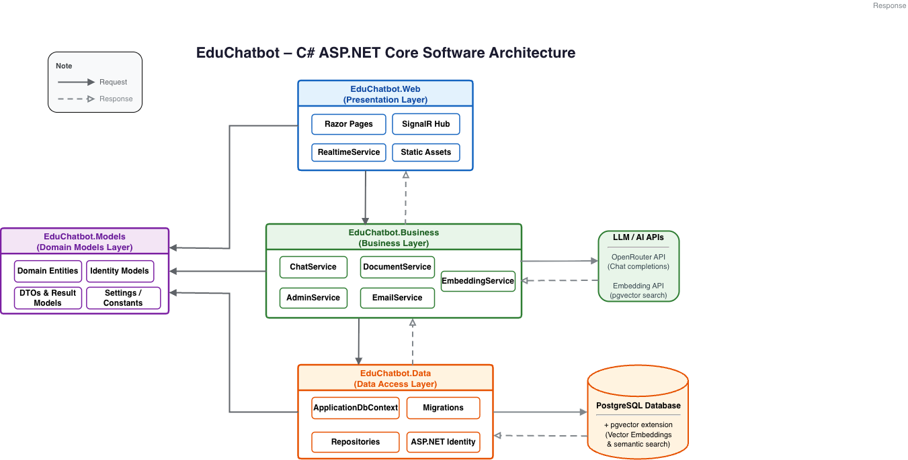

# EduChatbot - Hệ thống Chatbot học thuật & Luyện đề trắc nghiệm AI

EduChatbot là một ứng dụng web thông minh xây dựng trên nền tảng **ASP.NET Core Razor Pages (.NET 9)**, tích hợp trí tuệ nhân tạo (LLM thông qua OpenRouter API) và cơ sở dữ liệu Vector để hỗ trợ sinh viên học tập, ôn luyện dựa trên tài liệu môn học chính thức do giảng viên tải lên.

Hệ thống được thiết kế theo kiến trúc **3 lớp (3-Tier/3-Layer Architecture)** chặt chẽ và tích hợp cổng thanh toán tự động **PayOS** để nâng cấp gói dịch vụ.

---

## 1. Sơ đồ kiến trúc 3 lớp (Architecture Diagram)

Dự án tuân thủ nghiêm ngặt mô hình kiến trúc 3 lớp để đảm bảo tính dễ bảo trì, mở rộng và kiểm thử: 



### Chi tiết các phân lớp:
1. **Presentation Layer (EduChatbot.Web)**:
   * Chịu trách nhiệm nhận yêu cầu (HTTP Requests), hiển thị giao diện người dùng (Razor Pages), quản lý session đăng nhập và xử lý chuyển hướng.
   * Giao diện hỗ trợ song ngữ Anh - Việt linh hoạt và các thông báo được tối ưu bằng thư viện cao cấp SweetAlert2.
2. **Business Logic Layer (EduChatbot.Business)**:
   * Trực tiếp thực thi các nghiệp vụ cốt lõi: Tách văn bản tài liệu (text chunking), gọi API Embedding, truy vấn OpenAI/OpenRouter, quản lý gói cước (Basic/Premium) và kết nối cổng thanh toán PayOS.
3. **Data Access Layer (EduChatbot.Data)**:
   * Chứa cấu hình kết nối DB (DbContext), định nghĩa các bảng thông qua Entity Framework Core (EF Core) và quản lý các bản nâng cấp cơ sở dữ liệu (Migrations).
* **Cross-cutting Model Layer (EduChatbot.Models)**: Chứa các thực thực thể (Entities), Enum và lớp Identity dùng chung cho cả 3 lớp trên.

---

## 2. Chuẩn bị môi trường cài đặt

Trước khi chạy dự án, hãy chắc chắn máy tính của bạn đã cài đặt các công cụ sau:

1. **.NET 9 SDK**: Phiên bản mới nhất (kiểm tra bằng lệnh `dotnet --version`).
2. **Docker Desktop**: Cần thiết để khởi chạy nhanh PostgreSQL có hỗ trợ extension `pgvector` (tìm kiếm vector ngữ nghĩa).
3. **dotnet-ef CLI**: Công cụ dòng lệnh của Entity Framework Core. Nếu chưa có, hãy cài bằng lệnh:
   ```bash
   dotnet tool install --global dotnet-ef
   ```
4. **ngrok** (Không bắt buộc nhưng cần để test cổng thanh toán PayOS trên máy cá nhân): Dùng tạo đường hầm public webhook.

---

## 3. Các bước khởi chạy hệ thống (Cho người mới bắt đầu)

Hãy thực hiện tuần tự các bước dưới đây từ thư mục gốc của dự án (`EduChatbotSolution/`):

### Bước 1: Khởi động cơ sở dữ liệu PostgreSQL + pgvector
Dự án sử dụng tệp Docker Compose để chạy cơ sở dữ liệu trên cổng **5433** nhằm tránh xung đột với PostgreSQL mặc định (cổng 5432) trên máy của bạn.
1. Tạo một tệp tên `.env` nằm ở thư mục gốc (cạnh tệp `docker-compose.yml`) và điền mật khẩu database:
   ```env
   POSTGRES_PASSWORD=123456
   ```
2. Khởi chạy Docker container ở chế độ nền (detached mode):
   ```bash
   docker compose up -d
   ```
3. Kiểm tra xem database đã chạy chưa bằng lệnh: `docker ps`. Bạn sẽ thấy container `educhatbot-postgres` đang lắng nghe cổng `5433`.

### Bước 2: Thiết lập Cơ sở dữ liệu (Chọn 1 trong 2 cách sau)

#### Cách A: Chạy Migration của EF Core (Khuyên dùng - Nhanh nhất)
Lệnh này sẽ tự động đọc cấu hình code để tạo các bảng trống và tự động nạp dữ liệu mẫu (Seed Data) ban đầu gồm tài khoản Admin, Giảng viên, Sinh viên và các gói Subscription:
```bash
dotnet ef database update --project EduChatbot.Data --startup-project EduChatbot.Web
```

#### Cách B: Khôi phục từ file Backup Database `.dump`
Nếu giảng viên yêu cầu khôi phục trực tiếp từ file dữ liệu có sẵn của bạn (`educhatbotdb_before_pgvector.dump`):
1. Chạy lệnh khôi phục thông qua PostgreSQL client (hoặc pgAdmin/DBeaver kết nối vào cổng `5433` với mật khẩu `123456`).
2. Hoặc chạy lệnh restore trực tiếp vào Docker Container:
   ```bash
   docker exec -i educhatbot-postgres pg_restore -U postgres -d educhatbotdb < educhatbotdb_before_pgvector.dump
   ```

### Bước 3: Cấu hình API Key (Secrets)
Hệ thống sử dụng các khóa API bảo mật cho Chatbot AI, sinh Vector và thanh toán PayOS. Hãy tạo các cấu hình bảo mật này bằng công cụ **User Secrets** (không nên ghi đè trực tiếp vào file cấu hình gốc để tránh lộ thông tin):
1. Di chuyển vào thư mục Web: `cd EduChatbot.Web`
2. Khởi tạo secrets:
   ```bash
   dotnet user-secrets init
   ```
3. Cài đặt các khóa API tương ứng (Thay thế các giá trị mẫu bằng khóa thật của bạn):
   ```bash
   # Cấu hình API GPT/Nemotron của OpenRouter
   dotnet user-secrets set "OpenRouter:ApiKey" "sk-or-v1-..."
   dotnet user-secrets set "Embedding:ApiKey" "sk-or-v1-..."

   # Cấu hình tài khoản PayOS để test thanh toán
   dotnet user-secrets set "PayOS:ClientId" "your_client_id"
   dotnet user-secrets set "PayOS:ApiKey" "your_api_key"
   dotnet user-secrets set "PayOS:ChecksumKey" "your_checksum_key"
   ```

### Bước 4: Chạy dự án
1. Đứng tại thư mục dự án `EduChatbot.Web`, chạy lệnh:
   ```bash
   dotnet run
   ```
2. Màn hình console sẽ hiển thị cổng lắng nghe mặc định:
   ```text
   Now listening on: http://localhost:5287
   ```
3. Mở trình duyệt và truy cập: `http://localhost:5287`

---

## 4. Danh sách tài khoản thử nghiệm hệ thống

Hệ thống đã chuẩn bị sẵn các tài khoản thử nghiệm ứng với các vai trò (Roles) khác nhau:

| Vai trò | Email đăng nhập | Mật khẩu mặc định | Quyền hạn chính |
| --- | --- | --- | --- |
| **Admin** | `admin@educhatbot.local` | `Admin@123456` | Tạo môn học, kiểm duyệt tài liệu, quản lý và cấp tài khoản. |
| **Lecturer** | `lecturer@educhatbot.local` | `Lecturer@123456` | Tải lên tài liệu học tập PDF/DOCX cho môn học phụ trách. |
| **Student** | `student@educhatbot.local` | `Student@123456` | Hỏi đáp AI theo môn học, quản lý gói dịch vụ và ôn luyện làm Quiz. |

---

## 5. Hướng dẫn các Kịch bản Kiểm thử chính (Demo Guide)

Để giúp giảng viên kiểm tra nhanh các tính năng cốt lõi của đồ án, bạn hãy thực hiện theo trình tự sau:

### Kịch bản 1: Giảng viên tải tài liệu và sinh Vector tự động
1. Đăng nhập bằng tài khoản Giảng viên: `lecturer@educhatbot.local` / `Lecturer@123456`.
2. Truy cập mục **Upload Document**. Chọn môn học được phân công (ví dụ: *PRN222*) và tải lên một tệp tài liệu PDF hoặc Word ngắn.
3. **Kết quả**: Hệ thống tự động trích xuất văn bản, cắt đoạn và gọi API tạo Embedding. Sau khi tải lên thành công, trạng thái tài liệu sẽ là `Approved` và sẵn sàng làm nguồn dữ liệu trả lời.

### Kịch bản 2: Sinh viên dùng gói Basic và Kiểm soát giới hạn lượt hỏi (Quota)
1. Đăng nhập bằng tài khoản Sinh viên: `student@educhatbot.local` / `Student@123456`.
2. Truy cập trang cá nhân tại `/Subscription/Me`. Bạn sẽ thấy gói hiện tại là **Basic**, hạn mức tối đa **20 lượt hỏi/ngày** và tính năng Luyện đề (Quiz) đang hiển thị trạng thái: `Khóa - Yêu cầu nâng cấp Premium`.
3. Vào trang Chat, chọn môn học vừa tải tài liệu ở trên và gửi câu hỏi.
4. **Kiểm tra**:
   * Hệ thống sẽ trừ đi 1 lượt hỏi khả dụng của bạn (Còn lại 19/20).
   * Badge hiển thị số lượt hỏi còn lại hiển thị trực quan ở góc màn hình.
   * Nếu bạn hỏi hết số lượt cho phép, nút gửi và ô nhập liệu sẽ tự động khóa lại (disabled) và hiển thị thông báo yêu cầu nâng cấp gói lên Premium để tiếp tục trò chuyện.

### Kịch bản 3: Nâng cấp gói Premium qua cổng PayOS
1. Tại giao diện tài khoản Sinh viên, chọn trang gói dịch vụ: `/Subscription/Plans`.
2. Tại thẻ gói **Premium**, bấm chọn **Upgrade Premium**.
3. Hệ thống tạo hóa đơn thanh toán trên PayOS và tự động chuyển hướng bạn sang cổng thanh toán Sandbox của PayOS.
4. Quét mã QR thanh toán giả định của PayOS (chế độ Sandbox). Sau khi hệ thống nhận được giao dịch thành công:
   * Cổng thanh toán chuyển hướng bạn về trang `/Subscription/Callback` hiển thị giao diện chúc mừng nâng cấp thành công.
   * Quay lại trang cá nhân `/Subscription/Me`, trạng thái gói chuyển thành **Premium**, hạn mức tự động tăng lên **100 lượt hỏi/ngày**.
   * Tính năng làm bài trắc nghiệm (Quiz) được mở khóa hoàn toàn.
   * Toàn bộ các thông báo, popup xác nhận trong quá trình thi cử của sinh viên hay xuất bản đề của giảng viên đều đã được làm đẹp với giao diện SweetAlert2 cao cấp, hỗ trợ song ngữ Việt - Anh thời gian thực.
